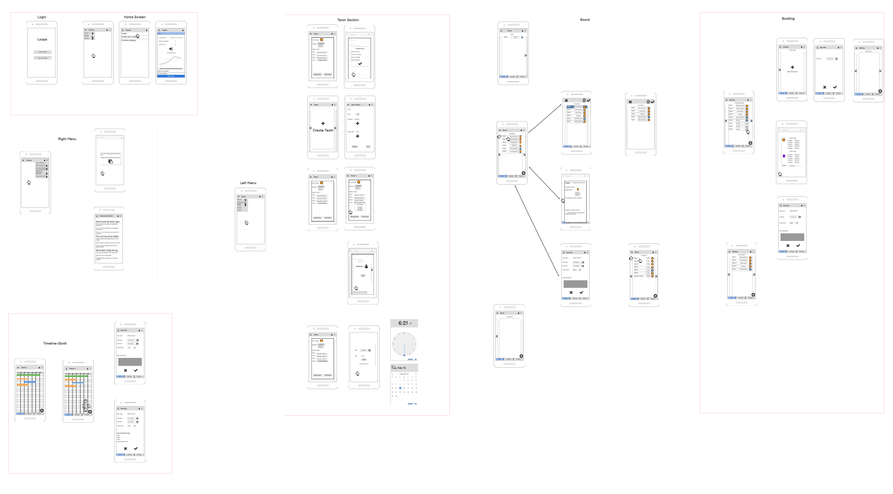
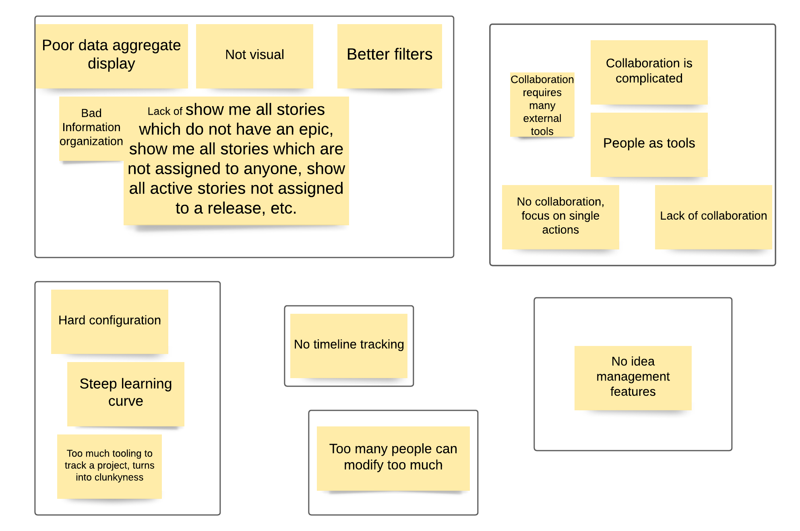
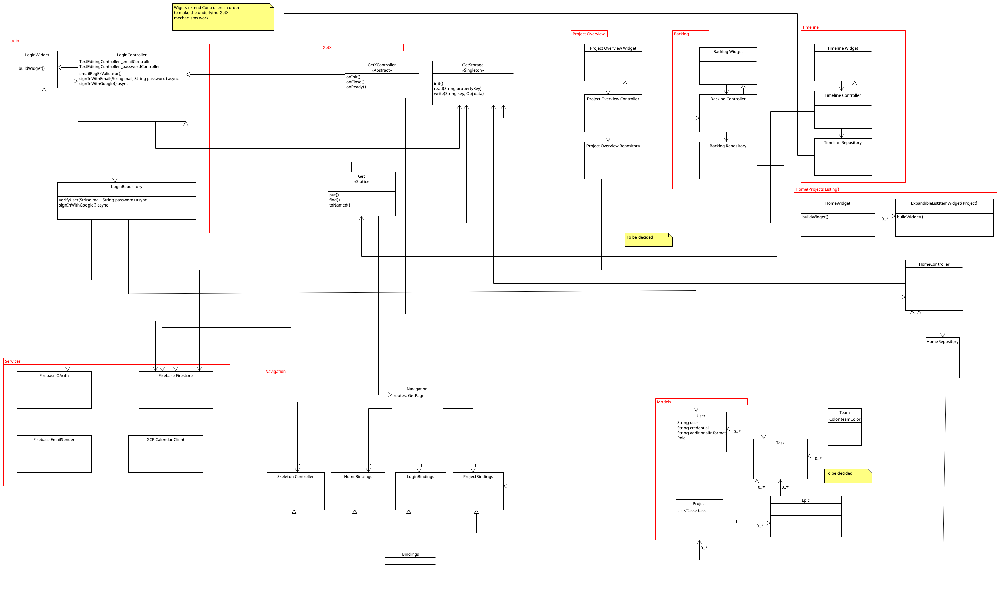

# Loops 🔁

First iteration of a MVP to handle a simplified Scrum workflow

- ✅ Manage current sprint tasks and a complete project backlog
- ✅ Notify via Mail for an incoming team or individual event
- ✅ Connect through Google Meet for video conferencing
- ✅ See project velocity by comparing Sprints and their relative degree of completion over a graph

## Process

### Followed methodologies
I've been following on the design portion lean ux, on the organisational aspect the Scrum methology with 1 week sprints, subsequent delivery and feedback/retrospective. This has been an occasion to test the Scrum methology first hand and see where it might fall short. Lean Ux on the other hand was the most approachable form of design thinking that I personally thought could be melded with Scrum.

### Common paint points discovery in organizational tools

Done following the design thinking methodology

- Initial phase of topic skimming through different resources and the official Scrum guide
- Analysis of secondary research over common workflows and pain points
- Primary research with restricted population samples
- Initial development of graphical Prototypes to reduce initial mistakes and iterations over each new discovery
  
- Development of an affinity diagram related to different problems sampled
  

### Initially proposed architecture draft
  Following an MVC pattern with Repository pattern for Firebase Services and an layer (Calendar Client) for the GCP Meet-Calendar service.
  

## Instructions to run

- Install an extension that can handle flutter builds or run it smoothly with Android Studio
- Clone the project in its current version
- Add the client Id's for both Android and Apple in a file named secrets.dart
- Refer to [FlutterFire Docs](https://firebase.google.com/docs/guides) for more information on how to run a Flutter project
